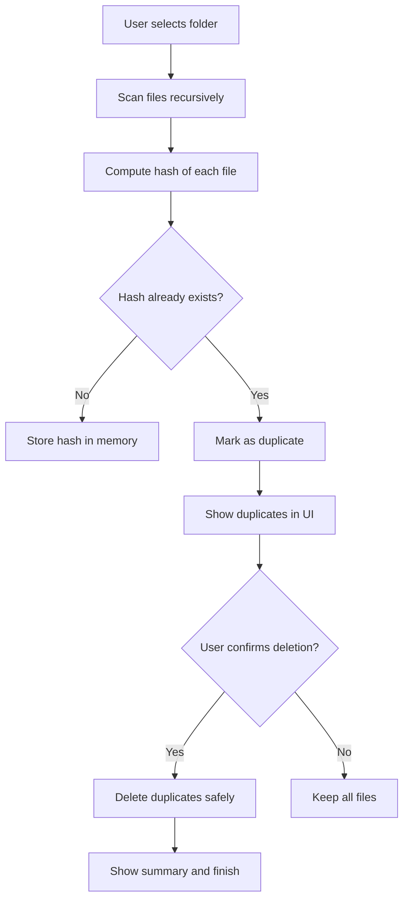
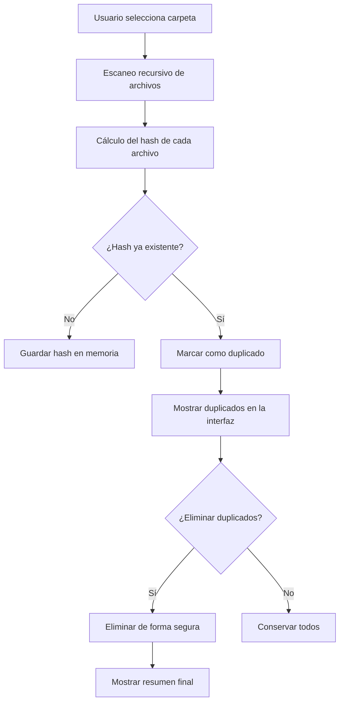

# 🧹 Duplicate File Remover

> 🇪🇸 **Versión en español abajo**

---

<p align="center">
  
  
  
  
  
</p>

---

## 🇬🇧 English

### 🧠 Overview

**Duplicate File Remover** is a desktop application built with **JavaFX** that scans directories to detect and remove duplicate files based on their **content hash**.  
It provides a **dark and modern UI**, fast performance with **parallel processing**, comprehensive logging, and multi-language support for a clean user experience in data organization.

---

### ✨ Features

- 🗂️ **Folder selection** via intuitive file chooser
- ⚡ **Fast duplicate detection** using efficient file hashing algorithms (SHA-256)
- 🧮 **Concurrent hash calculation** - Leverages multi-core CPUs for significantly faster scanning
- 🚀 **Automatic parallelism tuning** - Optimizes thread pool size based on available CPU cores
- 🤖 **Automatic deletion mode** - Skip preview and delete all duplicates with one confirmation
- 🔀 **Manual selection mode** - Review and select specific duplicates to delete
- 🛡️ **Original file protection** - Automatically preserves oldest file in each duplicate group
- 🧹 **Safe file operations** with user confirmation and comprehensive error reporting
- 🌙 **Dark, modern interface** built with JavaFX and custom CSS
- 🌍 **Multi-language support** (Spanish and English)
- 📝 **Comprehensive logging** with SLF4J and Logback
- 🔄 **Progress tracking** with cancellation support
- 📊 **Detailed results table** with sortable columns
- 🚀 **Maven-based build** for easy compilation and packaging

---

### 🧩 Technical Overview (Mermaid Diagram)



---

### 📋 Requirements

- **Java 17** or higher
- **Maven 3.9+** (for building)
- **Operating System**: Windows, macOS, or Linux with JavaFX support

---

### 🚀 Installation & Usage

#### Option 1: Using Maven (Recommended)

1. **Clone the repository:**
   ```bash
   git clone https://github.com/JesusLuna2309/Duplicate_File_Remover.git
   cd Duplicate_File_Remover
   ```

2. **Build the project:**
   ```bash
   mvn clean package
   ```

3. **Run the application:**
   ```bash
   mvn javafx:run
   ```

#### Option 2: Running the JAR

After building with Maven, you can run the generated JAR:
```bash
java -jar target/duplicate-file-remover-1.0.0-SNAPSHOT.jar
```

#### Usage Steps

1. **Launch** the application
2. **Select a folder** using the "Elegir carpeta" button
3. **Choose options**:
   - Check "Include subfolders" if you want to scan subdirectories
   - Check "Automatic deletion (no preview)" for automatic deletion mode (recommended for quick cleanup)
   - Uncheck "Automatic deletion" if you want to manually review and select files to delete
4. **Start scanning** with the "Empezar limpieza" button
5. **Automatic mode**: Confirm deletion when prompted - all duplicates will be deleted automatically (originals preserved)
6. **Manual mode**: Review duplicates in the results table, select files to delete, then click "Delete selected"

---

### 🛠️ Development

#### Building from Source

```bash
# Compile the project
mvn clean compile

# Run tests
mvn test

# Package as JAR
mvn clean package

# Run directly with JavaFX plugin
mvn javafx:run
```

#### Project Structure

```
Duplicate_File_Remover/
│
├── src/
│   ├── main/
│   │   ├── java/com/jesusluna/duplicateremover/
│   │   │   ├── MainApp.java              # Main application entry point
│   │   │   └── module-info.java          # Java module descriptor
│   │   └── resources/
│   │       ├── icons/                    # Application icons
│   │       ├── styles/                   # CSS stylesheets
│   │       ├── i18n/                     # Internationalization bundles
│   │       │   ├── messages.properties
│   │       │   ├── messages_es.properties
│   │       │   └── messages_en.properties
│   │       └── logback.xml               # Logging configuration
│   └── test/
│       ├── java/                         # Unit tests
│       └── resources/                    # Test resources
├── .github/
│   └── workflows/
│       └── build.yml                     # CI/CD workflow
├── pom.xml                               # Maven project configuration
├── .gitignore                            # Git ignore rules
├── .gitattributes                        # Git attributes for line endings
├── .editorconfig                         # Editor configuration
├── LICENSE                               # GPL v3 license
└── README.md                             # This file
```

---

### 🔒 Security Considerations

- **File deletion** is a destructive operation. Always review duplicates before deletion.
- **Dry-run mode** allows you to preview actions without making changes.
- **Logging** tracks all operations for audit purposes.
- **Confirmation dialogs** prevent accidental data loss.

---

### 🗺️ Roadmap

- [x] Maven-based build system
- [x] Multi-language support (ES/EN)
- [x] Comprehensive logging
- [x] CI/CD with GitHub Actions
- [x] Complete duplicate detection engine with hash comparison
- [x] Progress bar with cancellation support
- [x] Results view with duplicate groups
- [x] File preview thumbnails for images
- [x] Automatic deletion mode with original file protection
- [x] Manual selection mode with preview
- [x] Concurrent hash calculation for faster scanning
- [ ] Export results to CSV/JSON
- [ ] Move to trash instead of permanent deletion
- [ ] Hash caching for faster re-scans
- [ ] Advanced filtering options

---

### 🤝 Contributing

Contributions are welcome! Please follow these steps:

1. Fork the repository
2. Create a feature branch (`git checkout -b feature/AmazingFeature`)
3. Commit your changes (`git commit -m 'Add some AmazingFeature'`)
4. Push to the branch (`git push origin feature/AmazingFeature`)
5. Open a Pull Request

Please ensure:
- Code follows the project's style guidelines (.editorconfig)
- Tests pass (`mvn test`)
- Documentation is updated as needed

---

### 📄 License

This project is licensed under the **GNU General Public License v3.0** - see the [LICENSE](LICENSE) file for details.

---

### 👨‍💻 Author

Developed by **Jesús Luna Romero**  
📧 [jesuslunaromero230902@gmail.com](mailto:jesuslunaromero230902@gmail.com)

---

## 🇪🇸 Español

### 🧠 Descripción general

**Duplicate File Remover** es una aplicación de escritorio creada con **JavaFX** que permite analizar carpetas para detectar y eliminar archivos duplicados según su **hash de contenido**.  
Ofrece una **interfaz moderna y oscura**, un rendimiento rápido mediante **procesamiento paralelo**, y una experiencia limpia para mantener tu sistema ordenado.

---

### ✨ Características

- 🗂️ **Selección de carpetas** mediante un explorador intuitivo
- ⚡ **Detección rápida de duplicados** usando algoritmos eficientes de hash (SHA-256)
- 🧮 **Cálculo concurrente de hashes** - Aprovecha CPUs multinúcleo para escaneo significativamente más rápido
- 🚀 **Ajuste automático de paralelismo** - Optimiza el tamaño del pool de hilos según los núcleos disponibles
- 🤖 **Modo de eliminación automática** - Salta la vista previa y elimina todos los duplicados con una confirmación
- 🔀 **Modo de selección manual** - Revisa y selecciona duplicados específicos para eliminar
- 🛡️ **Protección de archivos originales** - Preserva automáticamente el archivo más antiguo de cada grupo
- 🧹 **Operaciones seguras** con confirmación del usuario y reporte completo de errores
- 🌙 **Interfaz moderna y oscura** construida con JavaFX y CSS personalizado
- 🌍 **Soporte multiidioma** (español e inglés)
- 📝 **Registro completo** con SLF4J y Logback
- 🔄 **Seguimiento de progreso** con soporte de cancelación
- 📊 **Tabla de resultados detallada** con columnas ordenables
- 🚀 **Construcción basada en Maven** para fácil compilación y empaquetado

---

### 🧩 Vista técnica (Diagrama Mermaid)



---

### 📋 Requisitos

- **Java 17** o superior
- **Maven 3.9+** (para compilar)
- **Sistema Operativo**: Windows, macOS o Linux con soporte para JavaFX

---

### 🚀 Instalación y Uso

#### Opción 1: Usando Maven (Recomendado)

1. **Clonar el repositorio:**
   ```bash
   git clone https://github.com/JesusLuna2309/Duplicate_File_Remover.git
   cd Duplicate_File_Remover
   ```

2. **Compilar el proyecto:**
   ```bash
   mvn clean package
   ```

3. **Ejecutar la aplicación:**
   ```bash
   mvn javafx:run
   ```

#### Opción 2: Ejecutar el JAR

Después de compilar con Maven, puedes ejecutar el JAR generado:
```bash
java -jar target/duplicate-file-remover-1.0.0-SNAPSHOT.jar
```

#### Pasos de Uso

1. **Inicia** la aplicación
2. **Selecciona una carpeta** usando el botón "Elegir carpeta"
3. **Elige opciones**:
   - Marca "Permitir actuar sobre subcarpetas" si quieres escanear subdirectorios
   - Marca "Eliminación automática (sin vista previa)" para modo automático (recomendado para limpieza rápida)
   - Desmarca "Eliminación automática" si quieres revisar y seleccionar archivos manualmente
4. **Inicia el escaneo** con el botón "Empezar limpieza"
5. **Modo automático**: Confirma la eliminación cuando se te pregunte - todos los duplicados se eliminarán automáticamente (se preservan los originales)
6. **Modo manual**: Revisa los duplicados en la tabla de resultados, selecciona archivos a eliminar y haz clic en "Eliminar seleccionados"

---

### 🔒 Consideraciones de Seguridad

- La **eliminación de archivos** es una operación destructiva. Siempre revisa los duplicados antes de eliminar.
- El **modo simulación** permite previsualizar acciones sin realizar cambios.
- El **registro (logging)** rastrea todas las operaciones con fines de auditoría.
- Los **diálogos de confirmación** previenen pérdida accidental de datos.

---

### 🗺️ Hoja de Ruta

- [x] Sistema de construcción basado en Maven
- [x] Soporte multiidioma (ES/EN)
- [x] Registro completo (logging)
- [x] CI/CD con GitHub Actions
- [x] Motor completo de detección de duplicados con comparación de hash
- [x] Barra de progreso con soporte de cancelación
- [x] Vista de resultados con grupos de duplicados
- [x] Miniaturas de vista previa para archivos de imagen
- [x] Modo de eliminación automática con protección de archivos originales
- [x] Modo de selección manual con vista previa
- [x] Cálculo concurrente de hashes para escaneo más rápido
- [ ] Exportar resultados a CSV/JSON
- [ ] Mover a papelera en lugar de eliminación permanente
- [ ] Caché de hash para re-escaneos más rápidos
- [ ] Opciones avanzadas de filtrado

---

### 🤝 Contribuir

¡Las contribuciones son bienvenidas! Por favor sigue estos pasos:

1. Haz un fork del repositorio
2. Crea una rama de característica (`git checkout -b feature/CaracteristicaAsombrosa`)
3. Haz commit de tus cambios (`git commit -m 'Agregar alguna CaracteristicaAsombrosa'`)
4. Haz push a la rama (`git push origin feature/CaracteristicaAsombrosa`)
5. Abre un Pull Request

Por favor asegúrate de que:
- El código sigue las guías de estilo del proyecto (.editorconfig)
- Las pruebas pasan (`mvn test`)
- La documentación se actualiza según sea necesario

---

### 📄 Licencia

Este proyecto está licenciado bajo la **Licencia Pública General de GNU v3.0** - consulta el archivo [LICENSE](LICENSE) para más detalles.

---

### 👨‍💻 Autor

Desarrollado por **Jesús Luna Romero**  
📧 [jesuslunaromero230902@gmail.com](mailto:jesuslunaromero230902@gmail.com)

---

⭐ *Si te gusta este proyecto, ¡dale una estrella en GitHub!*
