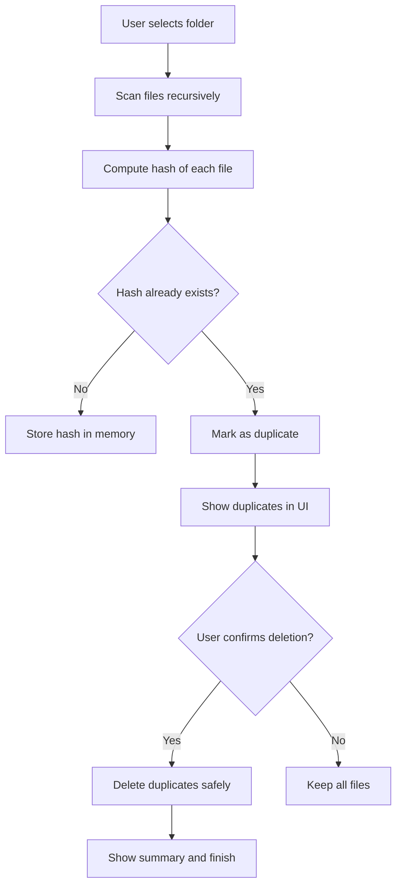
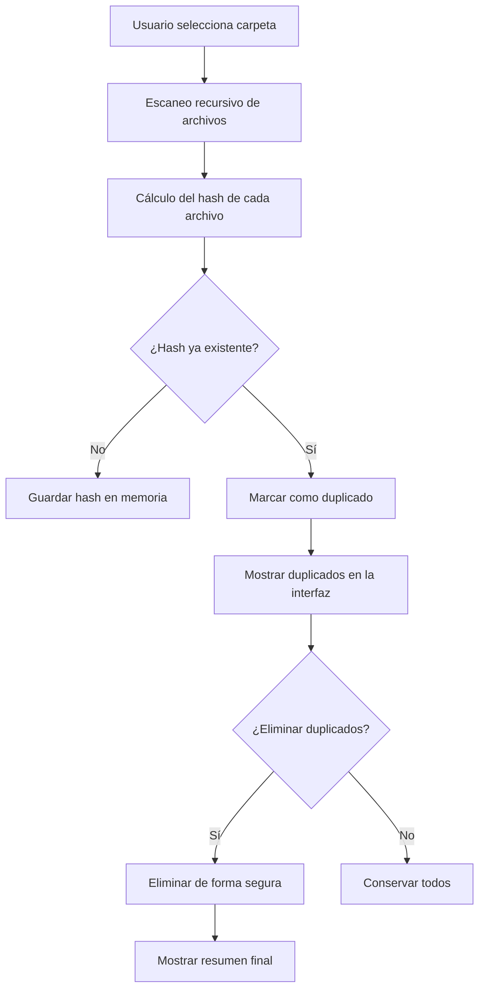

# 🧹 Duplicate File Remover

> 🇪🇸 **Versión en español abajo**

---

<p align="center">
  
  
  
  
</p>

---

## 🇬🇧 English

### 🧠 Overview

**Duplicate File Remover** is a desktop app built with **JavaFX** that scans directories to detect and remove duplicate files based on their **content hash**.  
It provides a **dark and modern UI**, fast performance with **parallel processing**, and a clean user experience for data organization.

---

### ✨ Features

- 🗂️ Folder selection via file chooser  
- ⚡ Fast duplicate detection using file hashing (MD5/SHA algorithms)  
- 🧮 Parallelized file scanning for better performance  
- 🧹 Safe file deletion with user confirmation  
- 🌙 Dark, modern interface built with JavaFX and CSS  
- 🧾 Real-time logs on console

---

### 🧩 Technical Overview (Mermaid Diagram)



---

### 🖼️ Screenshot (Placeholder)


---

### ⚙️ Built With

- 🧱 **Java 21+**
- 💠 **JavaFX 21**
- 🎨 **FXML** for the UI
- 🧰 **Eclipse IDE**
- 🧾 Optional: **Gradle / Java Modules**

---

### 🚀 How to Run

1. Clone the repository:
   ```bash
   git clone https://github.com/your-username/DuplicateFileRemover.git
   ```
2. Open it in **Eclipse** (or IntelliJ / VS Code).  
3. Ensure JavaFX is properly configured in the module path.  
4. Run the main class:
   ```
   application.MainApp
   ```
5. Select a directory → Scan → Review duplicates → Delete safely.

---

### 📁 Project Structure

```
DuplicateFileRemover/
│
├── src/
│   ├── application/        # Main Java source code
│   └── resources/
│       ├── icons/          # Icons and app images
│       ├── styles/         # Dark theme CSS
│       └── fxml/           # UI layouts
│
├── bin/                    # Compiled classes
├── README.md               # This file
└── module-info.java        # Module declaration
```

---

### 👨‍💻 Author

Developed by **Jesús Luna Romero**  
📧 [jesuslunaromero230902@gmail.com](mailto:jesuslunaromero230902@gmail.com)

---

## 🇪🇸 Español

### 🧠 Descripción general

**Duplicate File Remover** es una aplicación de escritorio creada con **JavaFX** que permite analizar carpetas para detectar y eliminar archivos duplicados según su **hash de contenido**.  
Ofrece una **interfaz moderna y oscura**, un rendimiento rápido mediante **procesamiento paralelo**, y una experiencia limpia para mantener tu sistema ordenado.

---

### ✨ Características

- 🗂️ Selección de carpeta con explorador de archivos  
- ⚡ Detección rápida de duplicados mediante hash (MD5/SHA)  
- 🧮 Escaneo de archivos en paralelo  
- 🧹 Eliminación segura con confirmación del usuario  
- 🌙 Interfaz oscura y moderna  
- 🧾 Registro de acciones en la consola

---

### 🧩 Vista técnica (Diagrama Mermaid)



---

### ⚙️ Tecnologías utilizadas

- 🧱 **Java 21+**
- 💠 **JavaFX 21**
- 🎨 **FXML** para la interfaz  
- 🧰 **Eclipse IDE**
- 🧾 Opcional: **Gradle / módulos Java**

---

### 🚀 Cómo ejecutar el proyecto

1. Clona este repositorio:
   ```bash
   git clone https://github.com/your-username/DuplicateFileRemover.git
   ```
2. Ábrelo en **Eclipse** o en tu IDE preferido.  
3. Configura correctamente las librerías de JavaFX.  
4. Ejecuta la clase principal:
   ```
   application.MainApp
   ```
5. Selecciona una carpeta → Analiza → Revisa duplicados → Elimina con seguridad.

---

### 📁 Estructura del proyecto

```
DuplicateFileRemover/
│
├── src/
│   ├── application/        # Código fuente Java
│   └── resources/
│       ├── icons/          # Iconos e imágenes
│       ├── styles/         # Estilos CSS
│       └── fxml/           # Vistas gráficas
│
├── bin/                    # Archivos compilados
├── README.md               # Este archivo
└── module-info.java        # Configuración del módulo
```

---

### 👨‍💻 Autor

Desarrollado por **Jesús Luna Romero**  
📧 [jesuslunaromero230902@gmail.com](mailto:jesuslunaromero230902@gmail.com)

---

⭐ *If you like this project, give it a star on GitHub!*
